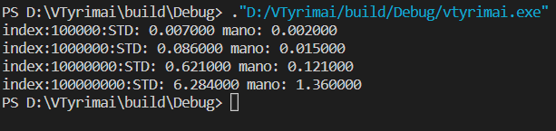

# VectorKlase

# Kaip naudotis?

## sukurti vektoriu:
Vector<Object> vec;

## prideti elementa:
vec.pushback(Object);

## pasiekti elementa:
vec.at(index);
# arba
vec[index];

## gauti begin iteratoriu:
vec.getBegin();

## gauti end iteratoriu:
vec.getEnd();

## istrinti elementa:
vec.erase(iterator)

VectorKlasesTyrimai:
Palyginimai skirtingu dydziu pushbackais
